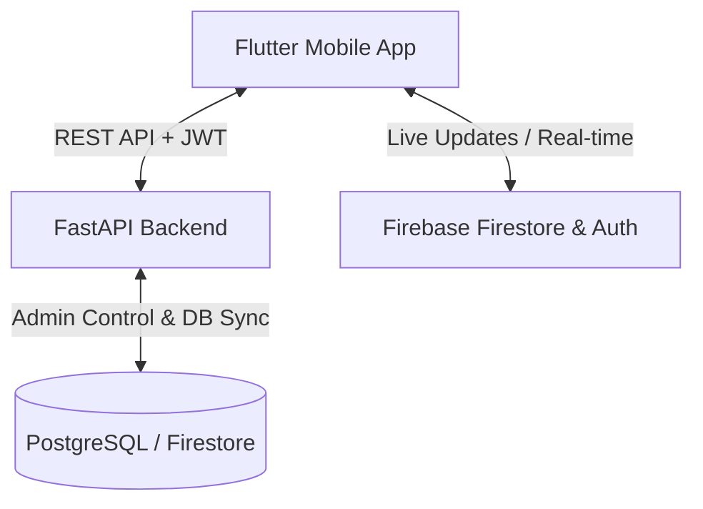

# Ease Home Service (On-Demand Service Marketplace)

Ease Home Service is a premium, robust, enterprise-ready on-demand home services platform. Designed with modern software engineering patterns, it integrates a powerful **Python FastAPI Backend** and a beautiful **Flutter Mobile Application** powered by **Riverpod 2.x** and **GoRouter** state/navigation paradigms.

---

## 🏛️ Overall Architecture & Stack

The platform is designed with a highly decoupled client-server architecture:



### 📱 Mobile Application (Flutter)
- **State Management:** Riverpod 2.x (using type-safe and performant `Ref` patterns).
- **Navigation:** GoRouter (declarative routing with centralized route definitions).
- **Network Layer:** Dio (fully wrapped inside a robust, auto-refreshing `ApiClient` interceptor).
- **Real-time Engine:** Firebase Firestore integration (live tracking, booking streams, and chat updates).
- **UI Design System:** Rich glassmorphism aesthetics, responsive styling, and modern color palettes defined in `lib/core/theme`.

### ⚡ Backend API (FastAPI)
- **Core Framework:** Python FastAPI (highly scalable, fully typed, automatic OpenAPI documentation).
- **Environment Management:** Virtual Environment (`venv`) for hermetic dependencies.
- **Authentication:** JWT (JSON Web Tokens) with background auto-refresh pipelines.
- **Integration Points:** Handles complex business logic, admin operations, pricing configurations, and AI-driven demand forecasting.

---

## 🛠️ Step-by-Step Local Setup

### 1️⃣ Backend Setup (`backend_api`)

1. **Navigate to the Backend Directory:**
   ```bash
   cd backend_api
   ```

2. **Activate the Virtual Environment:**
   - **Windows (PowerShell):**
     ```powershell
     .\venv\Scripts\Activate.ps1
     ```
   - **macOS / Linux:**
     ```bash
     source venv/bin/activate
     ```

3. **Install Dependencies:**
   ```bash
   pip install -r requirements.txt
   ```

4. **Launch the Hot-Reloading Development Server:**
   ```bash
   uvicorn app.main:app --reload --host 127.0.0.1 --port 8000
   ```
   *The interactive API documentation will be available at `http://127.0.0.1:8000/docs`.*

---

### 2️⃣ Mobile App Setup (`mobile_app`)

1. **Navigate to the Mobile Directory:**
   ```bash
   cd mobile_app
   ```

2. **Configure Environment Variables:**
   Create a `.env` file in the root of the `mobile_app/` directory:
   ```env
   BACKEND_URL=http://localhost:8000
   ```

3. **Sync Flutter Packages:**
   ```bash
   flutter pub get
   ```

4. **Verify Compilation Cleanliness:**
   Make sure the project has zero static analysis errors:
   ```bash
   flutter analyze
   ```

5. **Launch the Application:**
   ```bash
   flutter run
   ```

---

## 💎 Features & Service Flow

1. **Role-Based Portals:** Dedicated presentation layers and views for **Customers**, **Service Providers**, and **Platform Administrators**.
2. **AI-Powered Matching:** Intelligent dynamic pricing, dynamic quotes, and regional demand forecasting.
3. **Real-time Operations:** Firebase-backed live chat and live tracking for active bookings.
4. **Secure Transactions:** Detailed payout histories, provider balance performance indicators, and automated service dispute centers.
5. **Secure Authentication:** Integrated Firebase OTP verify flows paired with backend-verified JWT profiles.

---

## 🔍 Verification & Linting Guidelines

To maintain code excellence:
- Use **package imports** (`package:ease_home_service/...`) in Dart to prevent path breakage.
- Ensure all custom Riverpod state providers watch dependencies explicitly (e.g. using `ref.watch(dioProvider)`).
- Run `flutter analyze` prior to committing code to guarantee 100% clean compiles.
